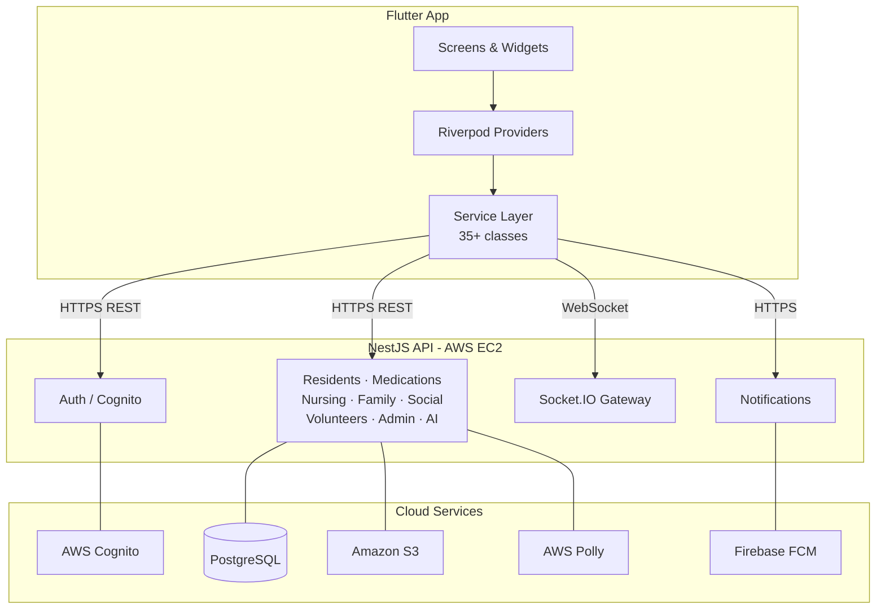
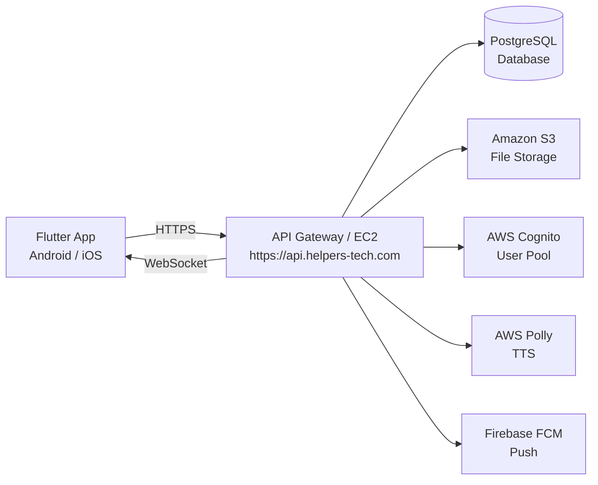
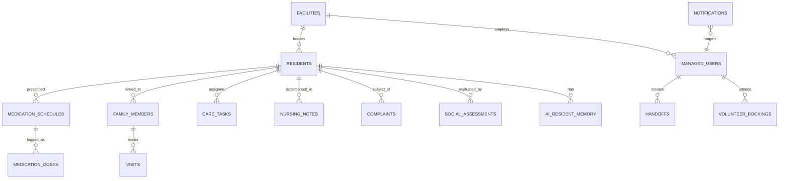

# Chapter 4: System Design and Implementation Documentation

**Project Title:** Wanas — Smart Elderly Care Management System (وَنَس)
**Department:** Multimedia — Web Development
**University:** International Academy of Engineering and Media Science
**Academic Year:** 2025 / 2026
**Students:** Amr Hani · Omar Eid · Shahd Osama · Farah Mohamed
**Supervisors:** Dr. Nabil El Ghamry · Dr. Amina Fawzy

---

## 4.1 Chapter Introduction

This chapter presents the design and implementation documentation of **Wanas** (وَنَس), a comprehensive smart elderly care management system developed as the team's graduation project. The chapter covers the system architecture, technologies, features, database design, API strategy, user interface, and deployment. It is intended to serve as a formal technical record of the project within the graduation book, complementing the accompanying demonstration and presentation.

> **ملخص:** يقدّم هذا الفصل التوثيق التقني الرسمي لنظام وَنَس — نظام إدارة رعاية المسنين الذكي — ويشمل المعمارية والتقنيات والميزات وتصميم قاعدة البيانات وواجهات برمجة التطبيقات والنشر.

---

## 4.2 Project Overview

Wanas (Arabic: وَنَس, meaning *companionship*) is a cross-platform mobile application built with Flutter, designed to digitise and unify the management of nursing home facilities. The system serves **six user roles**: Administrator, Nurse, Elderly Resident, Family Member, Social Specialist, and Volunteer — each with a dedicated, role-specific interface.

The platform integrates real-time communication, AI-powered companionship, medication tracking, social assessments, gamified activities, visit scheduling, and data-driven reporting into a single unified system. It is backed by a NestJS REST API deployed on AWS, using PostgreSQL as the primary database, AWS Cognito for identity management, and Firebase Cloud Messaging for push notifications.

The name reflects the system's core philosophy: elderly residents should never feel alone. Every feature — from the AI companion that converses with residents to the voice messages families can send — is designed to foster warmth, connection, and dignity.

> **ملخص:** وَنَس تطبيق هاتف متعدد الأنظمة يُوحّد إدارة دور رعاية المسنين لستة أدوار مستخدم، مدعومًا بواجهة برمجية NestJS على AWS وذكاء اصطناعي ورعاية شاملة في منصة واحدة.

---

## 4.3 Problem, Objectives, and Scope

### 4.3.1 Problem Statement

Traditional nursing home management relies on fragmented, paper-based or disconnected digital tools. This fragmentation causes medication errors, poor family communication, infrequent social assessments, lack of volunteer coordination, and no real-time operational visibility for administrators. Wanas was designed to solve all of these problems through a single integrated platform.

### 4.3.2 Project Objectives

| Category | Key Objectives |
|---|---|
| **Functional** | Role-specific interfaces for all six roles; full medication lifecycle management; real-time multi-party communication; AI companion; structured social assessment toolkit; gamified resident engagement; emergency SOS system |
| **Technical** | Clean layered Flutter architecture; full Arabic RTL support; JWT authentication via AWS Cognito; Socket.IO real-time events; Firebase push notifications; AWS S3 file storage; PDF report generation |
| **Educational** | Demonstrate production-level Flutter development; apply Riverpod state management; integrate AI services; practice software engineering principles (SRP, DRY, separation of concerns) |

### 4.3.3 Scope

**In scope:** Multi-role mobile app (Android & iOS), complete medication management, real-time communication (chat, voice messages, video calls), AI companion, social assessment tools, volunteer management, visit booking and approval, administrator dashboard with AI alerts, facility configuration, push and local notifications, biometric login, PDF report export, AWS S3 file uploads.

**Out of scope:** Web browser frontend, wearable device integration, HL7/FHIR EHR system integration, online payment gateway, multi-language localisation (English UI), offline-first data sync.

> **ملخص:** يعالج وَنَس تشتّت أدوات إدارة دور الرعاية التقليدية من خلال منصة موحدة. يشمل النطاق تطبيقًا محمولًا لستة أدوار مع رعاية كاملة وذكاء اصطناعي، ولا يشمل تطبيق ويب أو تكامل أجهزة صحية خارجية.

---

## 4.4 Technologies Used

| Technology | Category | Purpose in Wanas |
|---|---|---|
| **Flutter** | Mobile Framework | Cross-platform mobile app (Android & iOS) |
| **Dart** | Language | All application logic and UI code |
| **Riverpod** | State Management | Reactive state, provider pattern, data binding |
| **NestJS** | Backend Framework | RESTful API, business logic, module architecture |
| **PostgreSQL** | Database | Primary relational data store for all entities |
| **AWS EC2** | Cloud Hosting | Backend server runtime environment |
| **AWS Cognito** | Authentication | User pools, JWT issuance, role claims |
| **AWS S3** | Object Storage | Profile photos, documents, media uploads |
| **AWS Polly** | Speech Synthesis | AI companion text-to-speech voice output |
| **Firebase FCM** | Push Notifications | Device push notification delivery |
| **Socket.IO** | Real-Time | WebSocket bi-directional event broadcasting |
| **flutter_secure_storage** | Security | Encrypted JWT token storage (Keystore/Keychain) |
| **flutter_local_notifications** | Notifications | Scheduled medication and activity reminders |
| **Cairo Font** | Typography | Arabic typeface — 8 weight variants |
| **Material Design 3** | UI System | Component library, theming, accessibility |

> **ملخص:** يعتمد وَنَس مجموعة تقنيات حديثة تشمل Flutter و NestJS و AWS و Firebase و Socket.IO لتوفير تجربة متكاملة وآمنة وآنية.

---

## 4.5 System Architecture

### 4.5.1 Three-Layer Architecture

Wanas is built on a three-layer client–server architecture:

- **Mobile Client (Flutter):** Handles all user interaction, state management via Riverpod, and communication with the backend via HTTPS and WebSocket. Six independent UI modules serve six user roles.
- **Backend API (NestJS on AWS EC2):** Exposes a RESTful API at `https://api.helpers-tech.com`. Handles business logic, database operations, S3 coordination, AI orchestration, and real-time event broadcasting via Socket.IO.
- **Cloud Services Layer (AWS + Firebase):** Managed services — Cognito for identity, S3 for storage, Polly for TTS, and Firebase FCM for push delivery.

### 4.5.2 Application Architecture Diagram

### 4.5.3 AWS Deployment Architecture

> **ملخص:** يتكون النظام من ثلاث طبقات: تطبيق Flutter، وواجهة برمجية NestJS على AWS EC2، وطبقة خدمات سحابية (Cognito، S3، Polly، Firebase). تتواصل الطبقات عبر HTTPS و WebSocket.

---

## 4.6 Project Structure

The Flutter codebase follows a domain-based layered architecture inside the `lib/` directory.

| Folder / File | Purpose |
|---|---|
| `lib/models/app_models.dart` | All 50+ Dart data model classes in a single file; each model has `copyWith()` and computed getters |
| `lib/providers/app_riverpod.dart` | Central Riverpod `ChangeNotifier` managing auth state, loaded data, and user preferences (800+ lines) |
| `lib/services/` | 35+ service classes — one per domain (medications, AI, residents, volunteers, etc.); each communicates with one API module |
| `lib/screens/` | Role-based screen modules: `onboarding/`, `auth/`, `elderly/`, `nurse/`, `family/`, `specialist/`, `volunteer/`, `admin/`, `common/`, `chat/` — 75+ screen files total |
| `lib/widgets/` | Reusable UI components: AI voice assistant with seamless interaction, SOS button, live data banners, accessibility dialog, bottom nav bar |
| `lib/theme/app_theme.dart` | Complete design token system: colours, spacing, border radii, shadows, gradients |
| `lib/config/api_config.dart` | API base URL, AWS Cognito identifiers, request timeout constants |

---

## 4.7 Main System Features

| User Role | Key Features |
|---|---|
| **Administrator** | Real-time KPI dashboard; resident and staff CRUD; family visit approval; AI-generated health alerts; facility profile and billing settings configuration |
| **Nurse** | Resident medical profiles with vitals and care history; medication administration logging; care task management; shift handoff notes; PDF care report generation |
| **Elderly Resident** | Personalised home dashboard with points and streak; medication reminders with confirm/skip; family video calls and voice messages; photo memory albums; cognitive brain-training games; AI companion (chat + voice) |
| **Family Member** | Resident status and health monitoring; visit booking (physical and video); care report access; billing overview; chat with social specialist; media sharing to resident |
| **Social Specialist** | Standardised assessment tools (GDS and others); complaint lifecycle management; comprehensive 65-field resident files; KPI performance metrics; family messaging |
| **Volunteer** | Browse and book volunteer opportunities; session attendance tracking; ratings and performance reviews; achievement certificates; shareable public profile with CV upload |

**Cross-role features (all roles):** Profile management, biometric login, push and local notifications, accessibility settings (font scale, dark mode, high contrast), emergency SOS button, Arabic RTL throughout.

> **ملخص:** يوفر كل دور من الأدوار الستة واجهة مخصصة بميزات محددة. تشمل الميزات المشتركة: الملف الشخصي والإشعارات وإمكانية الوصول وزر الطوارئ.

---

## 4.8 Database Design Summary

### 4.8.1 Core Entities

| Entity | Description | Key Relationships |
|---|---|---|
| `facilities` | Registered nursing home profile | Parent of all data |
| `residents` | Full resident profile (65+ fields: personal, medical, social, dietary) | Belongs to facility |
| `managed_users` | Staff and volunteer accounts; linked to Cognito identity | Belongs to facility |
| `medication_schedules` | Recurring drug prescriptions per resident | Has many `medication_doses` |
| `medication_doses` | Individual dose administration events (taken / skipped / missed) | Belongs to schedule + resident |
| `care_tasks` | Daily nursing care assignments | Belongs to resident |
| `nursing_notes` | Freeform care notes by nurses | Belongs to resident + author |
| `handoffs` | Shift-change notes from outgoing to incoming nurse | Belongs to facility |
| `family_members` | Links a family user to a resident | Belongs to resident |
| `visits` | Physical or video visit requests and approvals | Belongs to resident + family member |
| `messages` | Text chat between family and specialist | Between managed users |
| `complaints` | Social care complaints with priority, status, and timeline | Belongs to resident |
| `social_assessments` | Completed assessment results with score and answers | Belongs to resident + specialist |
| `volunteer_bookings` | Volunteer session attendance records | Belongs to opportunity + volunteer |
| `ai_resident_memory` | Persistent AI context: summary, recommendations, warnings, mood | Belongs to resident |
| `notifications` | In-app notification records per user | Belongs to managed user |
| `video_calls` | Video call state tracking (initiated / active / ended) | Belongs to resident |
| `user_preferences` | Per-user UI settings (theme, font scale, contrast) | Belongs to managed user |

### 4.8.2 Entity Relationship Diagram

> **ملخص:** تعتمد قاعدة البيانات على PostgreSQL مع 20+ جدولًا مُدارة بملفات ترحيل SQL. المرفق (facility) هو الجذر الهرمي لجميع البيانات، ويرتبط بالمقيمين والموظفين والعمليات اليومية.

---

## 4.9 API and Authentication Summary

### 4.9.1 Authentication with AWS Cognito

Wanas uses a **delegated JWT authentication** model. The Flutter app never communicates with Cognito directly; instead, the NestJS backend acts as a secure proxy:

1. The app sends credentials to `POST /auth/login`.
2. The backend authenticates against Cognito (keeping the client secret server-side) and returns a signed **JWT ID token** and a refresh token.
3. The JWT is stored in `flutter_secure_storage` (Android Keystore / iOS Keychain).
4. Every subsequent request includes `Authorization: Bearer {id_token}`.
5. The JWT payload carries the user's `role`, `facilityId`, and `linkedResidentId` as custom Cognito claims, enabling role-based access control on the server.
6. Tokens refresh automatically before expiry; biometric login is supported as an optional layer.

### 4.9.2 API Modules Summary

| Module | Base Path | Key Operations |
|---|---|---|
| **Authentication** | `/auth` | Login, self-register, admin register, password reset, token refresh |
| **Residents** | `/residents` | CRUD, medical info update, photo upload, audit trail |
| **Medications** | `/medications` | Schedules, dose logging, overdue list, adherence stats |
| **Health & Vitals** | `/health` | Record vitals, alerts, threshold configuration |
| **Nursing Ops** | `/nursing-notes`, `/handoffs`, `/care-tasks`, `/meal-plans` | Full care operations |
| **Family Bridge** | `/family-bridge`, `/billing`, `/memories` | Visits, media sharing, invoices, memory wall |
| **Messages** | `/messages` | Text chat between family and specialist |
| **Social** | `/social`, `/complaints` | Assessments, GDS questions, KPIs, complaint management |
| **Volunteers** | `/volunteers` | Opportunities, bookings, certificates, ratings, documents |
| **Admin** | `/admin` | Staff CRUD, facility settings, staff performance |
| **AI** | `/ai` | Companion chat, health recommendations, TTS (Polly), persistent memory |
| **Notifications** | `/notifications` | In-app notifications, FCM push token management |
| **Real-Time** | `wss://` (Socket.IO) | Live events: SOS, overdue meds, visit requests, complaint updates |

> **ملخص:** تتواصل طبقة الخدمات في Flutter مع 12 وحدة API عبر HTTPS. المصادقة مُفوَّضة لـ AWS Cognito عبر الخادم. رمز JWT مُخزَّن مشفرًا ويُرفق بكل طلب. يُوفر Socket.IO الأحداث الآنية بنطاق المرفق.

---

## 4.10 User Interface and Accessibility

Wanas is built on **Material Design 3** with a fully custom design system tailored for an Arabic-speaking, elderly-focused audience.

**Design principles applied:**
- **Full RTL Arabic** rendering enforced globally via `Directionality.rtl`.
- **Cairo typeface** (8 weight variants) for optimal Arabic legibility across all screens.
- **Elderly-first simplicity:** Simplified navigation, large touch targets (≥44×44 dp), minimal visual noise, and clear iconography on resident-facing screens.
- **Accessibility controls** available to all users: adjustable font scale (×0.9 to ×1.5), high-contrast mode, and dark mode — all persisted per user via the backend.
- **Colour system:** Primary orange (#EA580C) for actions; indigo (#6366F1) for AI features; sky blue (#0369A1) for medical content; semantic colours for success, warning, and danger states.

**Screen distribution by role:**

| Role | Screen Count | Navigation Pattern |
|---|---|---|
| Elderly Resident | 9 screens | Bottom navigation bar (5 tabs) |
| Nurse | 9 screens + 2 tab views | Bottom navigation + tab views |
| Family Member | 7 screens | Bottom navigation + detail screens |
| Social Specialist | 7 screens + 5 tab views | Tab-based dashboard |
| Volunteer | 6 screens | Bottom navigation (5 tabs) |
| Administrator | 12 screens + 8 tab views | Multi-tab dashboard |
| Common (all roles) | 9 screens | Accessed from profile / settings |

> **ملخص:** الواجهة عربية كاملة من اليمين إلى اليسار بخط Cairo وألوان واضحة. تصميم شاشة المسن مبسّط بنصوص كبيرة وأزرار واضحة. تشمل إعدادات إمكانية الوصول تحجيم الخط والتباين العالي والوضع الداكن.

---

## 4.11 Testing and Deployment Summary

### 4.11.1 Testing Strategy

No automated tests exist in the current codebase. The recommended testing strategy for future iterations covers:

- **Unit tests:** Service method logic (adherence calculation, badge unlock conditions, UUID stripping).
- **Widget tests:** Form validation, screen rendering, accessibility controls.
- **Integration tests:** End-to-end flows (login → dashboard, medication confirmation, visit booking cycle).
- **API tests:** Postman collection covering all modules with positive and negative cases.
- **User acceptance testing:** Manual verification with representatives from each of the six user roles.
- **Accessibility tests:** TalkBack / VoiceOver screen reader verification; font scale and high-contrast visual review.

### 4.11.2 Deployment Configuration

| Component | Technology | Details |
|---|---|---|
| Backend host | AWS EC2 | NestJS API; managed with PM2 process manager |
| Database | PostgreSQL | Schema managed via numbered SQL migration files |
| File storage | Amazon S3 | Presigned URL upload pattern for all binary assets |
| Identity | AWS Cognito | User pool: `us-east-1_WQgMPSADf`; region: `us-east-1` |
| Push notifications | Firebase FCM | Project: `raaya-taptaba-app`; FCM token registered on login |
| Android release | Google Play | Signed `.aab` with `android/key.properties` keystore |
| iOS release | App Store Connect | `.ipa` built and uploaded via Xcode / Transporter |

> **ملخص:** الخلفية مُنشَرة على AWS EC2 وتُدار بـ PM2. قاعدة البيانات PostgreSQL مع ملفات ترحيل SQL. التطبيق يُوزَّع عبر Google Play وApp Store. لا توجد اختبارات مُؤتمَتة حاليًا والاستراتيجية الموصى بها موثَّقة للتطوير المستقبلي.

---

## 4.12 Limitations and Future Enhancements

### 4.12.1 Current Limitations

| Limitation | Description |
|---|---|
| No offline mode | The app requires an active internet connection at all times |
| Mobile only | No web dashboard; administrative tasks are phone-based only |
| Text-only chat | Media attachments in messages are not yet supported by the backend |
| Video call dependency | Video calls launch an external Zoom URL; no bundled SDK |
| No automated tests | Absence of test coverage creates regression risk during updates |
| Arabic only | No internationalisation infrastructure for additional languages |
| Phone-only UI | Layouts are not optimised for tablet screen sizes |

### 4.12.2 Recommended Future Enhancements

| Enhancement | Priority | Description |
|---|---|---|
| Offline-first architecture | High | Local SQLite cache (drift/isar) with background sync on reconnection |
| Web admin dashboard | High | Next.js or React web app for complex administrative workflows |
| Rich chat media | Medium | Backend extension to support photos and files in messages |
| Automated test suite | High | Unit, widget, and integration tests targeting ≥70% coverage |
| Multi-language support | Medium | Arabic, English, and French via Flutter `intl` package |
| Health device integration | Medium | Bluetooth vital monitors, pulse oximeters, smart bed sensors |
| Predictive health analytics | High | ML-based deterioration prediction from vitals and adherence history |
| HL7 FHIR integration | High | Exchange data with hospital EHR systems for care continuity |
| Expanded cognitive assessment | Medium | MMSE and MoCA tools added to the assessment library |
| Tablet layout support | Low | Adaptive two-column layouts using `LayoutBuilder` |

> **ملخص:** القيود الرئيسية هي غياب وضع العمل دون اتصال والاختبارات المؤتمتة ودعم الويب. التحسينات ذات الأولوية العالية تشمل ذاكرة التخزين المؤقت المحلية، ولوحة تحكم الويب، والتحليلات التنبؤية، وتكامل FHIR.

---

## 4.13 Chapter Conclusion

This chapter has presented a comprehensive yet concise technical account of the Wanas system — its architecture, technologies, features, database design, API strategy, user interface, and deployment infrastructure. The system represents a substantial engineering achievement: 75+ screens, 35+ service classes, 50+ data models, a deployed cloud backend, real-time communication, and AI integration — all unified within a single, role-aware mobile platform.

Beyond the technical metrics, Wanas embodies a human-centred design philosophy grounded in the project's name. The system was built not merely to digitise care administration, but to genuinely improve the daily lives of elderly residents — giving them companionship through AI, connection through family communication tools, and dignity through a thoughtfully accessible interface.

The project demonstrates the team's readiness to engage with complex, real-world engineering problems at a professional level. The architectural decisions made — delegated authentication, domain-scoped services, centralised state management, and a layered separation of concerns — reflect industry-standard practices that will serve as a strong foundation for future development. With the recommended enhancements in place, Wanas has the potential to grow into a commercially viable Digital Care Management Platform for the Arab healthcare sector.

The team acknowledges the invaluable supervision of **Dr. Nabil El Ghamry** and **Dr. Amina Fawzy**, whose guidance shaped both the technical direction and the academic rigour of this work.

> **الخاتمة:** يُمثّل وَنَس إنجازًا هندسيًا وإنسانيًا متكاملًا يجمع بين تقنيات الهاتف المحمول الحديثة والذكاء الاصطناعي والرعاية الإنسانية في منصة واحدة موحدة. يُعدّ هذا المشروع منطلقًا قابلًا للتطوير نحو منصة رعاية رقمية احترافية في القطاع الصحي العربي.

---

---

*This chapter is a condensed version of the full technical documentation prepared for the graduation project book.*

*Full documentation reference: `Wanas_Graduation_Project_Documentation.md`*

## Recent System Updates (June 2026)

### 1. UI/UX Notification System Overhaul
- **Previous Mechanism:** Custom Overlay entries (`_TopAlertOverlay`) which caused `Ticker` stability issues.
- **New Mechanism:** Global `ScaffoldMessenger` Snackbars. All system notifications and alerts are now displayed as animated, professional floating popups.
- **Server Terminology Abstraction:** To improve end-user experience, all technical AWS Cognito terminology has been abstracted. Any backend authentication or saving alerts now refer to the system simply as the "Server" (السيرفر), hiding AWS complexities from the UI.

### 2. AI Voice Assistant (Companion) Refactoring
- **Interaction Flow:** Removed the explicit "Thinking" (Wait state) visual indicator. The AI now seamlessly auto-deduces when the user has finished speaking by utilizing a 2-second voice activity detection timeout (down from 4 seconds).
- **Interruption Support:** The AI fully supports barge-in. If the user begins speaking while the AI is replying, the system instantly detects the interruption, stops the TTS playback, and resumes listening.
- **Control Interface:** The bottom control bar was simplified. It now features a single, prominent, animated "Mute" button to control the microphone, with the exit/close functionality moved to a cleaner top-right location.

### 3. Family Account Activities Scoping
- **Previous Bug:** Family accounts were unable to view the resident's activities because the API request was rigidly scoped to the `residentId`, while activities are often created as facility-wide events.
- **Resolution:** Modified the backend sync service (`backend_sync_service.dart`) to fetch activities for the Family and Resident roles without appending the `residentId` query parameter, ensuring all relevant facility activities are displayed correctly.

